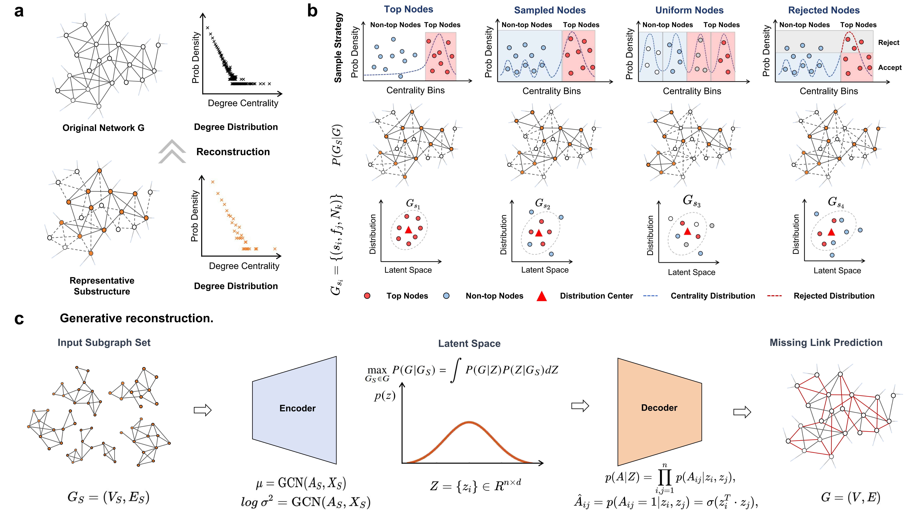

# Identifying representative subgraphs for reconstructing complex networks
This repository is designed to expose program code and network datasets from the article "Beyond Network Centraility: Uncertainty Induces More Representative Subgraphs".

**Abstract**：
Identifying small subgraphs that faithfully represent the structure of much larger networks is a fundamental problem in network sciences. Structural information is often assumed to be concentrated around highly central nodes, yet individually important nodes need not form a collectively representative subgraph. Here, we show that deterministic top-centrality selection can overconcentrate sampling on hubs and dense cores, producing induced subgraphs that deviate from characteristic network-wide structure. We introduce a centrality-probabilistic sampling framework that selects nodes stochastically according to centrality-derived probabilities and evaluate the resulting subgraphs using structure-based criteria. Across real-world citation, collaboration, biological networks, and synthetic networks, probabilistically sampled subgraphs generally achieve stronger link-prediction fidelity than top-centrality alternatives under the same node budget, with degree-guided, coreness-guided, and PageRank-guided sampling showing particularly robust performance. These subgraphs also more closely preserve degree distributions, sparsity, degree heterogeneity, and clustering structure, while retaining strong structure fidelity with only 5\%--20\% of the original nodes. Our results reveal that structural representativeness is not confined to network hubs, but emerges from a balanced sampling of central and peripheral nodes, providing a general principle for extracting informative substructures from large complex networks.


## Requirements
In order to be able to run the code, you need to install the packages contained in `requirements.txt`. We suggest to create a conda environment with
`conda create --name CEVAE --no-default-packages`, activate it with `conda activate CEVAE`, and install all the dependencies by running (inside `CEVAE` directory):


<p align="center">

  
<p align="center">

</p>


```bash
pip install -r requirements.txt
```


## Usage
To test the program on the given example scripts on Cora, sh scripts/cora.sh :  

```bash
for measures in pagerank core degree betweenness closeness gravitydegree gravitycore gravitypagerank gravitybetweenness gravitycloseness
  do
for method in sn tn rn un  
do 
    for numbers in $(seq 30 30  2708)
    do
        echo $measures
        python train.py --model=gcn_vae --dataset=cora  --task=link_prediction --fastgae=$method  --measure=$measures --alpha=1.0  --nb_node_samples=$numbers --learning_rate=0.008
    done
  done
done

```

You can find this list by running (inside `code` directory): 

```bash
python main.py --help
```
